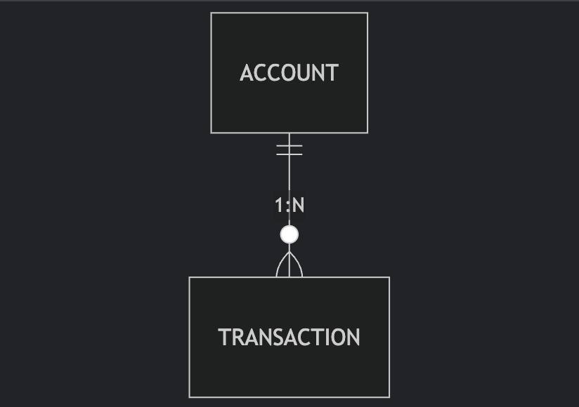

# Banking API - Backend Java con Arquitectura Hexagonal

Este proyecto es una API RESTful orientada al sector financiero, desarrollada con **Java 21** y **Spring Boot 3**, implementando una arquitectura hexagonal para garantizar una estructura limpia, mantenible y escalable. Permite gestionar cuentas bancarias, saldos y transacciones básicas.

## Tecnologías Utilizadas

- Java 21
- Spring Boot 3.x
- PostgreSQL
- Spring Data JPA
- Lombok
- JUnit 5 + Mockito
- Springdoc OpenAPI (Swagger UI)
- Docker / Docker Compose
- Arquitectura Hexagonal (Ports and Adapters)

## Estructura del Proyecto (Hexagonal)

```
src
├── domain
│   ├── model              # Entidades del dominio
│   └── port
│       ├── in             # Interfaces de casos de uso
│       └── out            # Interfaces de persistencia
├── application
│   └── service            # Implementación de lógica de negocio
├── infrastructure
│   ├── adapter
│   │   ├── in             # Controladores REST
│   │   └── out            # Adaptadores (JPA, DB, etc.)
│   └── config             # Configuraciones generales
└── MainApplication.java   # Punto de entrada
```

## Diagrama de Arquitectura Hexagonal


## Explicación:
- Verde: Capa de transporte (HTTP/REST).
- Azul: Controladores (adaptadores de entrada).
- Amarillo: Casos de uso (lógica de negocio).
- Morado: Puertos de repositorio.
- Gris: Base de datos (adaptador de salida).

## Diagrama Entidad-Relación


## Flujo de Solicitud


## Configuración de Perfiles

El proyecto utiliza perfiles de Spring para diferentes entornos:

### Perfil `local` (desarrollo)
- Usa una base de datos PostgreSQL local
- Habilita la recreación automática de tablas (ddl-auto=update)
- Configuración típica para desarrollo

### Perfil `docker` (producción/containers)
- Usa la base de datos PostgreSQL en contenedor
- Configuración optimizada para entornos containerizados
- Healthchecks integrados

## Configuración de Variables de Entorno

### Configuración común
| Variable                 | Descripción                     | Ejemplo                                   |
|--------------------------|---------------------------------|-------------------------------------------|
| `SERVER_PORT`            | Puerto de la aplicación         | `8080`                                    |
| `SPRING_PROFILES_ACTIVE` | Perfil activo                   | `docker` o `local`                        |

### Configuración local
| Variable                        | Descripción              | Ejemplo                                           |
|----------------------------------|--------------------------|---------------------------------------------------|
| `SPRING_DATASOURCE_URL`         | URL de conexión JDBC     | `jdbc:postgresql://localhost:5432/bankdb`         |
| `SPRING_DATASOURCE_USERNAME`    | Usuario de BD            | `postgres`                                        |
| `SPRING_DATASOURCE_PASSWORD`    | Contraseña de BD         | `admin`                                           |
| `SPRING_JPA_HIBERNATE_DDL_AUTO` | Estrategia DDL           | `update`                                          |

### Configuración Docker
Las variables para Docker están preconfiguradas en el docker-compose.yml

## Ejecución Local

### Requisitos previos
- Java 21 JDK instalado
- PostgreSQL 15+ instalado y corriendo
- Base de datos `bankdb` creada

### Opción 1: Usando Maven Wrapper

```bash
# Configurar variables (Linux/macOS)
export SPRING_PROFILES_ACTIVE=local
export SPRING_DATASOURCE_URL=jdbc:postgresql://localhost:5432/bankdb
export SPRING_DATASOURCE_USERNAME=postgres
export SPRING_DATASOURCE_PASSWORD=admin
export SPRING_JPA_HIBERNATE_DDL_AUTO=update

# Ejecutar aplicación
./mvnw spring-boot:run
```

## Ejecución con Docker

### Opción 1: Usando Docker Compose (recomendado)

```bash
# Construir imágenes y levantar contenedores
docker-compose up --build

# Detener y eliminar contenedores
docker-compose down

# Eliminar contenedores y volúmenes persistentes
docker-compose down -v
```

### Opción 2: Construir manualmente

```bash
# Construir imagen de la aplicación
docker build -t banking-api .

# Ejecutar contenedor
docker run -p 8080:8080 --name banking-api --network bank-network \
  -e SPRING_PROFILES_ACTIVE=docker \
  banking-api
```

## Swagger - Documentación de la API

Una vez en ejecución, accede a:

📎 [http://localhost:8080/api/swagger-ui/index.html](http://localhost:8080/api/swagger-ui/index.html)

## Pruebas

Ejecuta todas las pruebas unitarias con:

```bash
./mvnw test
./mvnw jacoco:report
```
## Estructura del Docker Compose

El archivo `docker-compose.yml` define:

- **banking-api**: Contenedor de la aplicación Spring Boot
    - Puerto: 8080
    - Depende del servicio postgres
    - Healthcheck integrado

- **postgres**: Contenedor de PostgreSQL
    - Puerto: 5432
    - Volumen persistente para datos
    - Healthcheck para verificar disponibilidad

- **Red personalizada**: `bank-network` para comunicación entre servicios

## Supuestos

- Las operaciones financieras son básicas (no incluyen transferencias entre usuarios aún).
- PostgreSQL es el motor de base de datos predeterminado.
- Para desarrollo local se recomienda usar el perfil local.
- Para entornos containerizados se recomienda usar el perfil docker.
## Autor

Desarrollado como parte de un **reto técnico para Backend Java Senior** con enfoque en el sector **bancario o financiero**.
